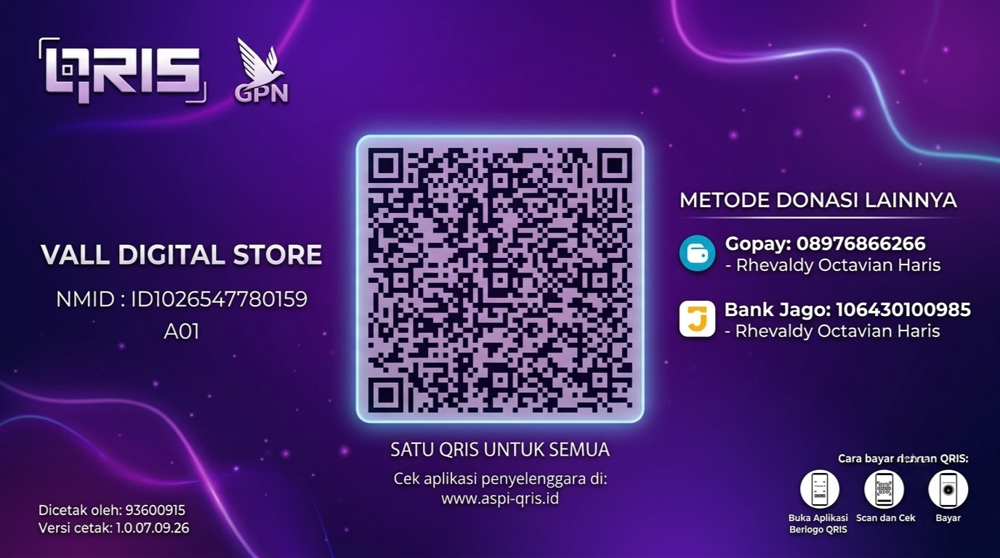

<div align="center">

# 🚀 CryptoTGBot

**Telegram Crypto Alert & Voice-Call Notification Bot**

Pantau harga crypto 24/7, dapat notifikasi lewat chat, dan **ditelfon langsung** oleh userbot saat target harga tercapai — lengkap dengan analisa market, prediksi, portfolio tracker, paper trading, sampai panel admin.

[](https://www.python.org/)
[](https://github.com/LonamiWebs/Telethon)
[](LICENSE)
[](#)

**⚡ Supported by PWGCloud**

</div>

---

## 📋 Daftar Isi

- [Fitur](#-fitur)
- [Arsitektur](#-arsitektur)
- [Tech Stack](#-tech-stack)
- [API Eksternal](#-api-eksternal-yang-digunakan)
- [Persyaratan Sistem](#-persyaratan-sistem)
- [Instalasi](#-instalasi)
- [Konfigurasi (.env)](#-konfigurasi-env)
- [🎬 Video Tutorial: Cara Dapat String Session](#-video-tutorial-cara-dapat-string-session)
- [Menjalankan Bot](#-menjalankan-bot)
- [Struktur Proyek](#-struktur-proyek)
- [Lisensi](#-lisensi)
- [Tentang Saya](#-tentang-saya)

---

## ✨ Fitur

### Untuk User
| Fitur | Keterangan |
|---|---|
| 🔔 **Price Alert** | Set alert naik/turun/trailing-stop dengan persentase custom & priority level (chat only / chat + telfon / telfon langsung) |
| 📞 **Voice Call Notification** | Userbot menelfon langsung via voice call Telegram + TTS Bahasa Indonesia saat alert critical tercapai |
| 📊 **Analisa Market** | Harga real-time, RSI, MA20/50/200, funding rate, Fear & Greed Index |
| 🔮 **Prediksi AI** | Skor & verdict berbasis indikator teknikal |
| 📰 **Berita Crypto** | Agregasi berita dengan deteksi sentimen bullish/bearish |
| 💼 **Portfolio Tracker** | Catat holding & pantau P/L real-time |
| 🎮 **Paper Trading** | Latihan trading tanpa uang asli, mulai dari $10,000 virtual |
| 🎯 **Alert Templates** | Preset alert siap pakai (Whale Entry, Moon Shot, Safety Net, Scalping) |
| 🎁 **Referral System** | Ajak teman, dapat reward slot alert tambahan |
| 🔕 **Quiet Hours** | Blokir telfon di jam tertentu, alert tetap masuk via chat |
| 🚨 **Panic Mode** | Matikan semua telfon secara instan dalam kondisi darurat |

### Untuk Admin
| Fitur | Keterangan |
|---|---|
| 📊 Dashboard statistik (user, alert, sponsor, channel) | |
| 📢 Broadcast pesan ke seluruh user | |
| 💰 Manajemen sponsor (footer promosi) | |
| 🔒 Force-join channel/grup sebelum akses bot | |
| 📞 Test call instan/terjadwal + riwayat | |

---

## 🏗️ Arsitektur

Proyek ini terdiri dari **2 proses independen** yang berjalan bersamaan:

```
┌─────────────────┐         IPC / DB          ┌──────────────────────┐
│   bot.py         │ ◄───────────────────────► │   userbot.py         │
│  (Bot Account)   │      (SQLite alerts.db)   │  (Userbot Account)   │
│                   │                           │                       │
│ • Menu & UI       │                           │ • Price monitor 24/7  │
│ • Inline buttons  │                           │ • Voice call + TTS    │
│ • Admin panel     │                           │ • Laporan harian/mgu  │
└─────────────────┘                           └──────────────────────┘
```

- **`bot.py`** — Bot biasa (via `BOT_TOKEN`) yang menangani seluruh UI, menu, dan interaksi user memakai **Telethon**.
- **`userbot.py`** — Akun Telegram pribadi (via **String Session**) yang memantau harga secara berkala dan melakukan **voice call** memakai **PyTgCalls**.

---

## 🛠️ Tech Stack

| Library | Versi | Fungsi |
|---|---|---|
| [Telethon](https://github.com/LonamiWebs/Telethon) | `>=1.34` | Client Telegram MTProto (bot & userbot) |
| [PyTgCalls](https://github.com/pytgcalls/pytgcalls) | `>=2.3.3` | Voice call & voice chat Telegram |
| [edge-tts](https://github.com/rany2/edge-tts) | `>=6.1` | Text-to-Speech (suara panggilan Bahasa Indonesia) |
| [aiohttp](https://github.com/aio-libs/aiohttp) | `>=3.9` | HTTP client async untuk request API market |
| [aiosqlite](https://github.com/omnilib/aiosqlite) | `>=0.19` | Database SQLite async |
| [python-dotenv](https://github.com/theskumar/python-dotenv) | `>=1.0` | Load konfigurasi dari file `.env` |
| [FFmpeg](https://ffmpeg.org/) *(system binary)* | terbaru | Mixing audio TTS + musik untuk voice call |

---

## 🌐 API Eksternal yang Digunakan

| Layanan | Kegunaan | Perlu API Key? |
|---|---|---|
| [CoinGecko](https://www.coingecko.com/en/api) | Harga real-time (USD/IDR), volume, perubahan 24h | ❌ Tidak |
| [Binance API](https://binance-docs.github.io/apidocs/) | Data candlestick (RSI, MA), funding rate futures | ❌ Tidak |
| [CoinPaprika](https://api.coinpaprika.com/) | Data harga cadangan (fallback) | ❌ Tidak |
| [Alternative.me](https://alternative.me/crypto/fear-and-greed-index/) | Fear & Greed Index | ❌ Tidak |
| [CryptoPanic](https://cryptopanic.com/developers/api/) | Agregasi berita crypto | ✅ Ya (opsional) |

---

## 💻 Persyaratan Sistem

| Komponen | Minimum | Catatan |
|---|---|---|
| **Python** | 3.10+ | Direkomendasikan 3.12 |
| **OS** | Linux, Windows, macOS | ✅ Diuji & direkomendasikan di **Linux (Ubuntu/Debian VPS)**. Windows & macOS bisa jalan selama FFmpeg terpasang & path dikonfigurasi dengan benar |
| **FFmpeg** | Terpasang & ada di `PATH` | Wajib untuk fitur voice call |
| **RAM** | 512 MB+ | 1 GB+ direkomendasikan kalau banyak user aktif |
| **Akun Telegram** | 2 akun | 1 untuk Bot (BotFather), 1 untuk Userbot (akun pribadi/kedua) |

**Instalasi FFmpeg per OS:**

```bash
# Ubuntu / Debian
sudo apt update && sudo apt install ffmpeg -y

# macOS (via Homebrew)
brew install ffmpeg

# Windows (via Chocolatey)
choco install ffmpeg
```

---

## 📦 Instalasi

```bash
# 1. Clone repository
git clone https://github.com/rhevaldyoctavianharis-netizen/CryptoTGBot.git
cd CryptoTGBot

# 2. Buat virtual environment (opsional tapi direkomendasikan)
python3 -m venv venv
source venv/bin/activate        # Linux/macOS
venv\Scripts\activate           # Windows

# 3. Install dependencies
pip install -r requirements.txt

# 4. Salin & isi file konfigurasi
cp .env.example .env
nano .env    # isi sesuai bagian "Konfigurasi (.env)" di bawah

# 5. Siapkan asset (opsional, untuk tampilan panel yang aesthetic)
#    - thumbnail.jpg  → gambar panel menu bot
#    - music.mp3      → musik latar saat voice call (auto-generate sine wave kalau kosong)
```

---

## ⚙️ Konfigurasi (.env)

| Variabel | Wajib | Deskripsi | Cara Dapatkan |
|---|:---:|---|---|
| `API_ID` | ✅ | ID API Telegram | [my.telegram.org](https://my.telegram.org) → API Development Tools |
| `API_HASH` | ✅ | Hash API Telegram | [my.telegram.org](https://my.telegram.org) → API Development Tools |
| `BOT_TOKEN` | ✅ | Token bot untuk `bot.py` | Buat via [@BotFather](https://t.me/BotFather) → `/newbot` |
| `SUPER_ADMIN_ID` | ✅ | User ID Telegram kamu (akses panel admin) | Cek via [@userinfobot](https://t.me/userinfobot) |
| `USERBOT_SESSION` | ✅ | String Session akun userbot (yang melakukan voice call) | 👉 Lihat [video tutorial](#-video-tutorial-cara-dapat-string-session) di bawah |
| `CRYPTOPANIC_KEY` | ⬜ Opsional | API key untuk fitur berita crypto | [cryptopanic.com/developers/api](https://cryptopanic.com/developers/api/) |

> ⚠️ **Jangan pernah membagikan `USERBOT_SESSION` ke siapa pun** — string ini setara dengan login penuh ke akun Telegram kamu.

---

## 🎬 Video Tutorial: Cara Dapat String Session

Untuk `USERBOT_SESSION`, **kami tidak merekomendasikan pakai script generator pihak ketiga sembarangan**. Cara paling aman & praktis adalah lewat bot khusus **[@ssgenduabot](https://t.me/ssgenduabot)**.

Tonton video di bawah untuk langkah lengkapnya (klik gambar untuk memutar):

<div align="center">

[](https://github.com/rhevaldyoctavianharis-netizen/CryptoTGBot/blob/main/video.mp4)

*🎥 Klik gambar di atas untuk menonton video tutorial (`video.mp4`)*

</div>

> 💡 **Catatan:** GitHub otomatis menampilkan video player kalau kamu membuka file `.mp4` langsung di halaman repo (`blob view`). Pastikan file `video.mp4` sudah kamu upload ke root repository ini agar link di atas berfungsi.

**Ringkasan langkah (detail lengkap ada di video):**
1. Buka [@ssgenduabot](https://t.me/ssgenduabot) di Telegram.
2. Ikuti instruksi bot untuk login dengan akun yang akan dijadikan **userbot** (bukan akun utama kamu, disarankan pakai akun kedua).
3. Setelah proses selesai, bot akan memberikan **String Session**.
4. Salin string tersebut ke variabel `USERBOT_SESSION` di file `.env`.

---

## ▶️ Menjalankan Bot

Bot & userbot berjalan sebagai **2 proses terpisah** — jalankan keduanya bersamaan:

```bash
# Terminal 1 — Bot utama (menu, UI, admin panel)
python3 bot.py

# Terminal 2 — Userbot (monitor harga + voice call)
python3 userbot.py
```

**Direkomendasikan pakai process manager** agar tetap jalan di background dan auto-restart kalau crash, misalnya:

```bash
# Menggunakan tmux
tmux new -s cryptobot-bot 'python3 bot.py'
tmux new -s cryptobot-userbot 'python3 userbot.py'

# Atau menggunakan pm2
pm2 start bot.py --interpreter python3 --name cryptobot-bot
pm2 start userbot.py --interpreter python3 --name cryptobot-userbot
```

---

## 📁 Struktur Proyek

```
CryptoTGBot/
├── bot.py                   # Entry point bot (UI & menu)
├── userbot.py                # Entry point userbot (monitor & call)
├── config.py                  # Konfigurasi & konstanta
├── requirements.txt
├── .env.example
├── thumbnail.jpg              # Gambar panel menu
├── music.mp3                  # Musik latar voice call (opsional)
├── video.mp4                  # Video tutorial string session
│
├── bot_app/
│   ├── client.py               # Inisialisasi Telethon bot client
│   ├── helpers.py               # Helper: safe_edit, send_panel, dll
│   └── handlers/
│       ├── start.py               # /start, onboarding, force-join
│       ├── commands.py            # /add /portfolio /panic /resume /admin
│       ├── user_menu.py           # Semua callback menu user
│       ├── admin_menu.py          # Semua callback panel admin
│       ├── text_input.py          # Alur input teks multi-step
│       └── paper_helper.py        # Handler /paper buy /paper sell
│
├── userbot_app/
│   ├── client.py                # Inisialisasi Telethon + PyTgCalls
│   ├── monitor.py                # Loop pemantau harga 24/7
│   ├── caller.py                 # Logic voice call + TTS
│   ├── reports.py                # Laporan harian/mingguan
│   └── testcall.py               # Fitur test call admin
│
├── services/
│   ├── market.py                 # Integrasi CoinGecko/Binance/dll
│   └── prediction.py             # Logic prediksi
│
├── database/                    # Layer database (aiosqlite)
└── ui/
    ├── texts.py                  # Semua template teks pesan
    └── keyboards.py               # Semua layout inline keyboard
```

---

## 📄 Lisensi

Proyek ini dilisensikan di bawah **[MIT License](LICENSE)** — bebas digunakan, dimodifikasi, dan didistribusikan ulang, dengan tetap mencantumkan atribusi.

---

## 👤 Tentang Saya

<div align="center">

### Rappzz

Dibuat & dikembangkan oleh **Rappzz**

[](https://github.com/rhevaldyoctavianharis-netizen)
[](https://rhevaldy.my.id)
[](https://t.me/rapaldy)
[](mailto:me@rhevaldy.my.id)

**Butuh String Session Generator?** Coba **[@ssgenduabot](https://t.me/ssgenduabot)** 🤖

---

**⚡ Powered & Supported by PWGCloud**

</div>
